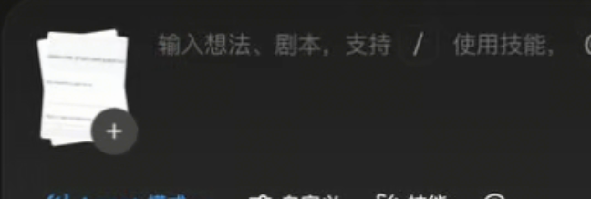
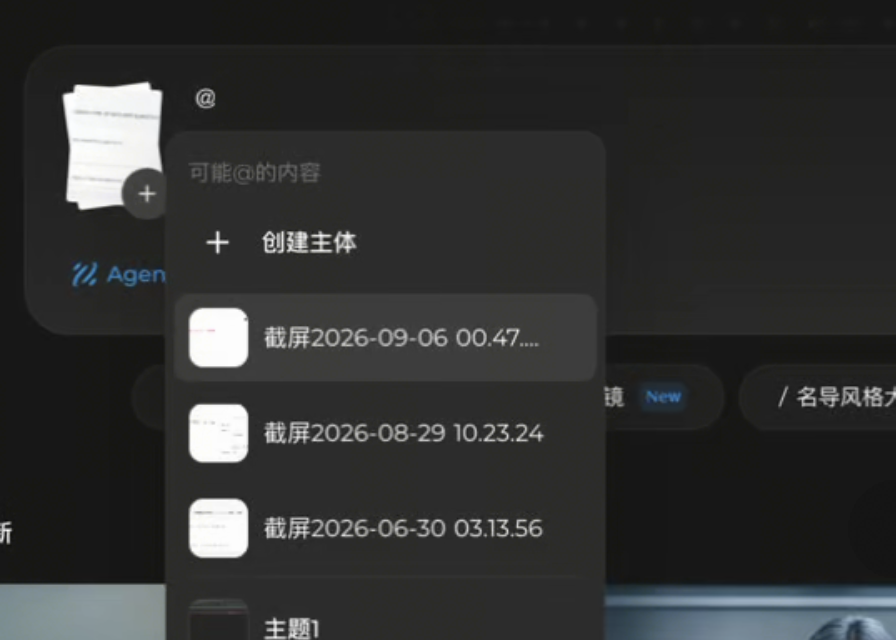

# AI 创作台需求文档

## 1. 文档定位

- 页面名称：**AI 工作台**（原需求文档名称为 AI 创作台）。
- 本文整理一期产品范围、页面结构、交互、数据要求和验收标准，作为后续开发依据；当前已制作前端交互，真实 Agent 与生成接口尚未接入，待用户验收。
- 需求依据：用户文字说明、页面参考截图及后续补充的多图展示、主体与素材引用效果图。文字要求优先；截图用于说明界面与交互，不代表截图中的品牌、型号、限制或全部入口都需要照搬。
- 下文明确区分已确认范围、建议交互规则和待确定事项。建议规则用于形成完整实现方案，不代表用户已逐项确认。

## 当前开发范围与落地方式

- 顶部导航在「我的画布」左侧新增「AI 工作台」，路由为 `/ai`，占据导航下方内容区域；「画布」切换进入现有画布列表。
- 当前只实现前端交互：发送打开创作内容预览，不发起 Agent 或生成请求。
- 主体与工作台草稿使用浏览器本地持久化；工作台和我的资产共用主体库。
- 我的资产在「全部」后新增「主体」，顺序为全部、主体、文本、图片、视频；创建成功后进入主体列表，同时出现在全部分类，支持搜索、分页、查看、编辑和删除。
- 主体弹窗的添加音色本轮使用本地音频文件上传和试听；不涉及声音克隆或训练。
- 自动偏好默认开启，关闭后可设置图片 / 视频参数；模型读取项目现有配置。真实模型能力约束待接口接入时处理。
- 主体暂未接入普通资产包导入导出、WebDAV 或服务器同步；资产页导入导出在存在主体时标明普通资产范围。
- 以下章节保留完整目标需求，尚未接入的生成链路属于后续工作；当前实现清单见待测试文档。

## 2. 目标与一期范围

用户在一个简洁的创作入口中输入需求、添加参考素材、引用可复用主体和已上传素材、设置图片或视频生成偏好，通过 Agent 发起创作。

**主体创建与引用是核心功能，一期必须完整实现，不能只提供占位按钮或普通的 `@名称` 文本。**

| 模块 | 一期范围 |
| --- | --- |
| 欢迎区 | 保留欢迎标题与居中的创作区域 |
| 生成 / 画布 | 保留参考布局中的入口切换，画布承接方式待确定 |
| 创作输入 | 文字输入、参考素材添加、主体与已上传素材引用、发送 |
| Agent 模式 | 一期只支持 Agent，不提供其他创作模式 |
| 自定义 | 完整保留截图中的自动开关、图片 / 视频、比例、模型、清晰度设置 |
| 引用主体 | 创建主体、保存主体、展示主体列表、通过 `@` 选择并用于创作 |
| 引用上传素材 | 同一个 `@` 面板列出当前创作已上传的素材，可直接引用，无需先创建主体 |
| 添加主体弹窗 | 按本轮图三整理：参考主体、添加音色、名称、描述、保存和关闭 |
| 技能 | 不做技能按钮、`/` 技能菜单、快捷技能、更多技能及相关标签 |
| 账号与营销 | 不显示右上角头像、通知、积分、会员等信息 |
| 底部展示 | 不做「最近上新」、宣传卡片、推荐作品等展示区 |
| 语音识别 / 输入 | 明确不做输入区右侧麦克风、录音和语音转文字功能；主体的「添加音色」仍保留 |

“自定义全部”指截图中已展示的全部生成偏好能力，不默认扩展为未展示的时长、帧率、种子、批量数量等参数。

## 3. 页面布局与文案

页面由上至下为：欢迎标题 → 生成 / 画布切换 → 大尺寸创作输入区。输入区之后留白，不再出现技能条或上新内容。

输入区内部布局：

- 左侧：参考素材添加入口「＋」及已添加素材预览。
- 中部：支持文字、主体引用和素材引用混排的编辑区。
- 底部左侧：`Agent 模式`、`自动 / 自定义`、`@ 引用`。
- 底部右侧：仅保留发送按钮，不显示麦克风或语音识别入口。

建议文案：

| 位置 | 文案 |
| --- | --- |
| 页面导航名称 | AI 创作台 |
| 欢迎标题 | 你好，今天想要创作什么？ |
| 输入占位提示 | 输入想法、剧本或上传参考，输入 @ 引用主体或已上传素材，和 Agent 一起创作 |
| 偏好弹层标题 | 生成偏好 |
| 引用选择标题 | 可引用的内容 |
| 主体空状态 | 你还没有创建主体 |
| 主体创建入口 | 创建主体 |
| 主体弹窗标题 | 设置主体 |

视觉要求：沿用截图的大留白、宽输入区、圆角和轻量背景层次，适配项目主题；弹层、按钮和输入框复用项目视觉规范。页面文案使用中文，窄屏下工具栏与设置项可换行，弹窗内容可滚动，保存按钮始终可访问。

## 4. 创作输入与参考素材

### 4.1 输入能力

- 支持多行需求和剧本文字。
- 支持光标位置插入主体或已上传素材引用，普通文字与引用混合编辑。
- 工具栏点击 `@` 与直接输入 `@` 使用同一套主体与素材选择逻辑。
- 打开设置、选择主体、创建主体期间保留当前文本、素材和光标位置。
- 移除占位文案中的技能提示；`/` 按普通文字处理，不触发技能选择。

### 4.2 普通参考素材

- 点击「＋」添加参考素材，已添加内容显示预览并支持移除。
- 普通参考素材用于本次创作；主体参考素材属于可复用主体，两者在数据中保留各自用途。
- 图片预览保持原始比例，不因缩略图展示而改变生成使用的原图。
- 普通附件支持的媒体类型、来源，以及是否支持拖拽和粘贴，列入实施前待确定事项。

#### 多张参考图片的展示（补充效果图）

- 适用位置：AI 创作台主输入区左侧的普通参考图片区域，不是「设置主体」弹窗中的参考图片区。
- 添加多张图片后，以紧凑的缩略图卡片堆叠展示；卡片轻微错位、旋转，露出后方图片边缘，表达已添加多张图片。
- 图片堆叠保持在输入区左侧，不随图片数量横向铺满输入框，为右侧文字编辑保留空间。
- 堆叠右下角叠放圆形「＋」按钮，作为继续添加图片的入口；点击后向已有图片中追加，不替换已有图片。
- 堆叠仅用于缩略展示，所有已添加图片仍保留并参与本次创作；不能只提交最上层图片。
- 每张图片仍需可预览、移除；截图未展示展开方式，点击或悬停后的具体交互待确定，不视为已确认设计。
- 不根据示意图推断图片数量上限或固定可见层数，也不恢复截图中的技能提示。

### 4.3 建议交互规则

- 默认保留当前草稿；切换偏好或打开主体弹窗不清空输入。
- 引用列表打开时，上下键选择、回车插入、Esc 关闭；中文输入法候选确认不能触发发送。
- 空白输入且没有有效创作内容时禁用发送；仅有主体或附件能否直接提交，待明确 Agent 的任务入口规则。
- 发送处理中显示状态，避免同一次点击重复提交；失败后保留草稿并展示原因。
- 具体换行、发送快捷键沿用项目已有约定，实施时核查。

## 5. Agent 模式

- 一期固定为 Agent 模式，工具栏保留模式名称及图标。
- 只有一个模式时不展示无内容的下拉菜单，不提供其他模式占位项。
- Agent 接收完整创作内容：文字、主体及素材引用、普通参考素材和生成偏好。
- Agent 模式与生成类型是两个概念：固定 Agent 模式下仍支持选择图片或视频。
- 具体复用哪套 Agent 接入、模型与连接状态管理，需要开发前核查现有实现。

## 6. 自定义生成偏好

点击工具栏「自动 / 自定义」打开生成偏好弹层。图片与视频设置均属于一期必做项。

### 6.1 完整设置清单

| 设置 | 图片 | 视频 |
| --- | --- | --- |
| 自动开关 | 支持 | 支持 |
| 类型切换 | 图片 | 视频 |
| 比例 | 智能、1:1、3:4、16:9、4:3、9:16、2:3、3:2、21:9 | 智能、21:9、16:9、4:3、1:1、3:4、9:16 |
| 模型选择 | 图片生成模型 | 视频生成模型 |
| 清晰度选择 | 图片清晰度 / 分辨率 | 视频清晰度 / 分辨率 |

截图中的「图片 4.0」「即梦 Seedance 1.5 Pro」「高清 2K」「720P」为示例选中值，不代表本项目已经接入，也不构成默认值或完整选项列表。模型和清晰度应来自项目实际配置与模型能力。

### 6.2 自动与自定义的建议语义

- 自动开启：工具栏显示「自动」，由 Agent 在可用能力范围内决定生成偏好。
- 自动关闭：工具栏显示「自定义」，使用用户选定的类型、比例、模型和清晰度。
- “智能比例”只表示比例自动决定，不等同于整个生成偏好切回自动。
- 自动模式下是否仍允许锁定图片 / 视频类型、手动设置是否禁用，以及首次进入的默认状态，需要实施前明确。
- 图片和视频分别保留各自的手动配置，来回切换不互相覆盖。
- 重新打开弹层时展示当前配置；点击外部或按 Esc 关闭。

### 6.3 模型能力与提交要求

- 实际提交必须携带并使用生成偏好，不能只改变界面选中态。
- 比例按钮保留截图规定的目标范围；所选模型不支持的选项应明确提示或禁用。
- 切换模型导致已选参数失效时，让用户看到原因并重新选择，不静默替换。
- 未配置可用模型时展示明确状态和项目现有模型配置入口。
- 清晰度候选值、默认模型和默认比例待核查现有配置后确定，不照搬截图，也不增加未经确认的行为边界。

## 7. 主体创建与主体 / 素材引用

### 7.1 主体的含义

主体是可重复引用的创作对象，由名称、参考素材、描述及可选音色组成，可以用于表达人物、角色、产品或其他对象。这些是使用场景，一期不因此额外增加分类字段。

一次创作可以引用多个主体；每个主体拥有稳定标识，避免同名或改名导致引用关系混乱。

### 7.2 统一引用面板（主体与已上传素材）

- 点击工具栏 `@`，或在编辑区输入 `@`，打开同一个引用面板。
- 面板保留「创建主体」入口，同时展示当前创作已上传的素材和已保存主体；参考截图在创建入口下先列上传素材，再列主体。
- 上传素材显示缩略图（无图像预览时使用类型图标）和文件名；主体显示缩略图和主体名称。长文件名截断展示，仍需有方式查看完整名称。
- 上传完成的素材自动进入候选列表，无需先转成主体；主体内部的参考图片不因此自动变成独立上传素材候选。
- 本次素材引用范围是当前创作已上传的附件，不默认扩展到「我的素材」全库。
- 没有主体但已有上传素材时，仍正常展示素材列表及创建入口；两者都为空时提示可上传素材或创建主体。
- 建议支持按主体名称和素材文件名筛选；无匹配时保留创建主体入口，不隐藏已有上传入口。
- 选择后在当前光标位置插入对应类型的引用，关闭面板并回到输入。
- 主体项的更多操作作为主体管理入口，具体操作见建议项；上传素材不套用主体编辑菜单。

### 7.3 添加主体弹窗（本轮图三）

| 字段 / 操作 | 必填 | 要求 |
| --- | --- | --- |
| 参考主体 | 是 | 添加主体参考图片；已添加图片可预览、移除，保留继续添加入口 |
| 添加音色 | 否 | 保留图中的独立添加入口，可为主体关联音色；具体选择或上传流程待确定 |
| 名称 | 是 | 输入主体名称；空白名称不能保存 |
| 描述 | 否 | 多行输入主体特征或创作补充说明 |
| 保存 | — | 必填内容有效且资源保存成功后，保存主体并更新列表 |
| 关闭 | — | 右上角关闭弹窗，返回原创作上下文 |

截图名称框显示 `0/20`。这是参考产品的限制，本文不直接将 20 字作为本项目上限；是否采用、计数方式与超限提示需确认后实现。参考图片数量、文件大小、格式、音频时长等限制同样不预设。

音色属于主体配置，不能替换成主输入框的麦克风语音输入。保存后如何显示已关联音色、试听、更换与移除，以及生成模型如何使用音色，需要补充交互与接口定义。

建议创建流程：

1. 从 `@` 面板点击「创建主体」。
2. 添加参考图片，填写名称，可选填写描述与添加音色。
3. 点击保存，持久化主体及关联资源。
4. 保存成功后关闭弹窗，新主体立即出现在列表，并插入原输入位置。
5. 取消或保存失败时保留原创作草稿；失败时保留弹窗内容和明确错误信息。

### 7.4 引用在输入框中的表现

- 主体引用作为独立标签展示，可带缩略图及名称，能够与普通文字混排。
- 引用内部保存主体标识，不能只存名称字符串。
- 标签整体删除，删除当前引用不删除主体库中的主体。
- 同一主体可在不同语句中重复引用，保持各处文本关系；底层资源可复用。
- 建议点击标签查看主体信息，支持键盘操作和草稿恢复。

示例：让 `@小白` 拿着 `@我的产品` 站在窗边，保持 `@我的产品` 的包装外观。

### 7.5 主体管理建议

图四展示了更多操作入口，但没有展开菜单。建议一期在该入口提供编辑和删除，以支持主体持续使用；具体菜单项尚待确认。

- 编辑复用「设置主体」弹窗，更新名称、参考图片、描述和音色。
- 改名不改变主体标识，已有草稿仍关联同一主体。
- 删除前说明影响；删除主体不应破坏已提交创作的记录。
- 草稿中的主体已删除或资源丢失时，标记失效并提示替换或移除，不能悄悄忽略后继续提交。

### 7.6 已上传素材引用规则

- 与主体引用使用一致的标签交互，可展示缩略图与文件名，并与文字、主体引用混排。
- 每个上传素材拥有稳定标识；同名文件、多次引用及附件排列变化不能导致引用错位。
- 引用指向已上传附件，不复制创建新附件。同一素材被多次提及时保留各处语义，提交资源时复用同一附件。
- 移除文字中的引用标签，不删除对应上传附件；未被 `@` 提及的附件仍按普通参考素材参与创作。
- 从附件区域移除已被引用的素材时，列表同步移除该素材，文本中对应引用标记失效并提示处理；发送前要求移除或替换失效引用。
- 素材引用必须关联到实际文件，不能只向 Agent 传递文件名。

示例：让 `@小白` 穿上 `@服装参考.png` 中的衣服，背景参考 `@场景参考.png`。其中小白是主体，后两项是当前上传的素材。

## 8. 发起创作与引用生效

完整流程：进入 AI 创作台 → 输入需求 → 上传并引用素材，或引用 / 创建主体 → 设置图片 / 视频偏好 → 发送给 Agent → 展示任务进展与结果。

提交内容至少表达以下信息：

| 内容 | 要求 |
| --- | --- |
| 创作模式 | 固定 Agent |
| 输入内容 | 保留文字顺序、主体及素材引用位置、引用类型与对应稳定标识 |
| 主体信息 | 每个被引用主体的名称、描述、参考图片和可选音色 |
| 普通参考素材 | 本次创作附件、稳定标识及用途，保持文中素材引用与实际文件的对应关系 |
| 生成偏好 | 自动状态、生成类型，以及适用的比例、模型、清晰度 |

主体参考图片必须传入实际创作链路，并保持图片与主体的对应关系。只把主体名称拼入提示词不算完成主体引用功能。多个主体不能被无差别合并成一组失去归属的附件。

若选定模型不支持当前主体媒体、音色或多主体用法，应在可确定的最早环节说明，并让用户调整；不能静默丢弃引用内容。视觉或声音一致性需要实际模型验证，不能仅凭 UI 验收承诺效果。

提交后的对话界面、任务进度、结果展示位置，以及结果与画布的关系，截图未展示。此部分是完整流程的依赖，必须在实施接入前确定，优先复用项目已有能力。

## 9. 数据与实现约束

以下是逻辑数据要求，不预先规定具体 TypeScript 字段或新增架构：

- 主体记录：稳定标识、名称、描述、参考图片资源关联、封面来源、可选音色关联。
- 创作草稿：文字与引用的结构化内容、普通附件、生成偏好；引用需区分主体与上传素材两种类型，并保存对应稳定标识，不能只按名称或列表序号定位。
- 创作提交：建议保留本次使用的主体信息快照和资源关联，避免后续编辑主体改变历史记录。
- 主体及需要持久化的业务数据默认使用项目的 `localforage` 方案；不把业务列表、图片或大 JSON 写入 `localStorage`。
- 不默认主体已接入 WebDAV 或服务器同步；是否加入现有同步域另行确定。
- 媒体删除需要考虑主体、草稿与已提交记录的共享引用，避免误删仍被使用的资源。
- 复用项目现有主题、模型配置、媒体存储、编辑器提及和 Agent 能力；开发前核查实际代码，不把可能可复用的内容写成已确认支持。
- 页面放在 `web/src/pages/`，页面私有弹层和 hook 就近组织；跨页面主体状态需要共享时使用 `web/src/stores/`。
- 外部生成服务接入沿用 `web/src/services/api/` 与现有请求方式，不为这个页面假设新增项目后端。
- 不新增未经确认的超时、重试、媒体数量、大小、并发等限制。

## 10. 开发工作拆分

| 工作项 | 交付内容 |
| --- | --- |
| 页面入口与布局 | AI 创作台路由和导航、欢迎区、生成 / 画布入口、主题与窄屏适配 |
| 创作编辑区 | 文字输入、普通参考素材、结构化主体与素材引用、发送状态 |
| 生成偏好 | 自动状态、图片与视频完整设置、配置保留、模型能力校验 |
| 主体数据 | 本地主体记录、参考媒体及可选音色关联、资源生命周期 |
| 引用选择 | `@` 触发、主体与当前上传素材混合列表、空状态、创建主体入口、引用插入 |
| 主体弹窗 | 参考图片、音色入口、名称、描述、校验与保存 |
| 主体管理 | 按确认后的菜单实现编辑与删除，处理失效引用 |
| Agent 接入 | 传递引用、资源及偏好，接通提交、进展、失败与结果承接 |
| 文档与验收 | 实现后将待办移至待测试，记录版本级功能变化 |

## 11. 验收清单

以下用于后续实现验收，不表示当前已开发或已测试。涉及建议规则及待确定项的条目，应先完成产品确认再验收。

- [ ] 页面名称为 AI 创作台，保留欢迎区和创作输入区。
- [ ] 不显示账号、通知、积分、会员、最近上新、宣传卡片等被排除内容。
- [ ] 输入区右侧无麦克风、录音或语音识别功能，主体弹窗仍保留添加音色入口。
- [ ] 无技能按钮、技能快捷条、更多技能、`/` 技能菜单及技能占位提示。
- [ ] 仅有 Agent 模式，无其他模式和空下拉菜单。
- [ ] 添加多张普通参考图片后，输入区左侧以轻微错位、旋转的缩略图堆叠展示，右下角「＋」可继续追加；已有图片不丢失，文字输入空间不被多图列表挤占。
- [ ] 堆叠中的每张参考图片均可按最终确定的交互预览和移除，提交包含全部有效图片。
- [ ] 图片与视频均可设置比例、模型和清晰度；自动与智能比例语义清楚。
- [ ] 图片 / 视频切换、弹层关闭再打开时，配置按约定保留。
- [ ] 不支持的模型参数有清楚提示，实际请求使用选定配置。
- [ ] 工具栏 `@` 和键入 `@` 都能打开包含主体与当前已上传素材的引用列表；没有主体但已有素材时仍可选择素材。
- [ ] 已上传素材可直接引用，无需创建主体；列表显示缩略图和文件名，同名文件能准确区分。
- [ ] 主体与素材可以混合、多次引用；提交时保留准确映射，同一附件不会因多次引用而重复添加。
- [ ] 删除素材引用标签不移除附件；移除被引用的附件后，失效引用有明确提示并在发送前处理。
- [ ] 添加主体弹窗包含参考主体、添加音色、必填名称、可选描述及保存操作。
- [ ] 参考图片和名称缺失时不可保存，保存失败不丢失表单内容。
- [ ] 创建完成后可立即引用，刷新后仍能读取本地主体及其资源。
- [ ] 多主体与同主体多次引用均保留文本位置和准确资源归属。
- [ ] 删除引用不删除主体，主体改名或失效按约定处理。
- [ ] 音色入口按最终确定的方式完成添加与使用，不是无效占位按钮。
- [ ] Agent 收到主体图片、描述、适用音色和生成偏好，不能只收到主体名称。
- [ ] 提交失败保留创作内容；成功后进入已确定的进展与结果流程。
- [ ] 浅色、深色与窄屏下编辑区和弹窗可正常使用。

## 12. 实施前待确定事项

这些细节不影响一期核心范围的确定，不应以此推迟主体引用或视频自定义设置。

1. **页面承接**：导航位置；「画布」打开已有项目、项目列表还是新画布；发送后进入哪里；结果如何进入画布。
2. **Agent 接入**：使用项目哪套 Agent 通路，创作台如何关联会话与任务。
3. **自动语义与默认值**：首次默认自动还是自定义；自动时是否保留类型选择；默认模型、比例和清晰度。
4. **模型能力**：图片与视频实际可选模型、清晰度及多主体支持；不支持配置的具体交互。
5. **添加音色**：选择现有音色、上传参考音频或其他方式；预览和移除交互；生成链路如何使用音色。不默认包含声音克隆或音色训练。
6. **素材规则**：普通附件支持的类型与来源；多图堆叠的展开、逐图预览及移除交互；主体参考图片数量、格式和大小；是否采用截图中的名称 20 字上限及超限处理。
7. **主体管理细节**：更多菜单是否采用编辑 / 删除；保存后是否按建议自动引用；关闭未保存表单时的处理。
8. **提交与保存规则**：仅主体 / 附件能否直接提交；草稿保存与历史快照方式；主体是否纳入现有同步能力。
